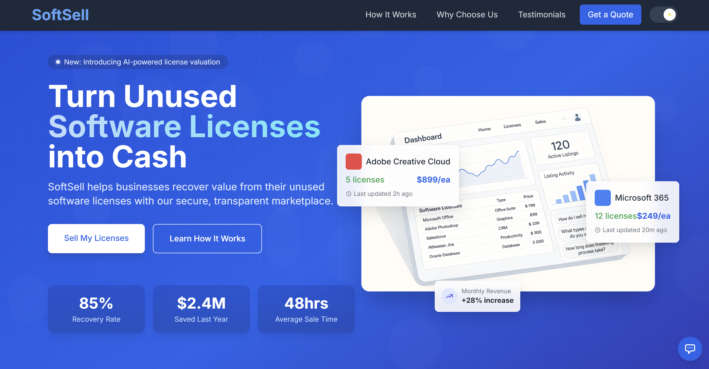

# SoftSell - Software License Resale Platform



## Project Overview

SoftSell is a modern, responsive single-page marketing website designed for a software license resale platform. The platform enables businesses to monetize their unused software licenses through a secure, transparent marketplace. This project demonstrates my ability to create visually engaging, high-performance web applications with a focus on UX/UI excellence.

## Live Demo

[View Live Site](https://softsell-sepia.vercel.app/)

## Features

### 🎨 Modern UI/UX
- **Eye-catching Hero Section** with parallax effects, 3D hover interactions, and animated statistics
- **Dynamic Animations** using Framer Motion for smooth, engaging user experiences
- **Responsive Design** that adapts perfectly to all screen sizes and devices

### 💻 Technical Implementation
- **React Components** built with modern functional architecture and hooks
- **Tailwind CSS** for streamlined styling with a consistent design language
- **Advanced Animation Techniques** including scroll-triggered animations, 3D transforms, and motion effects
- **Interactive Elements** including animated counters, hover states, and transitional effects

### 📱 Core Sections
- **Hero Section** - Visually compelling introduction with clear value proposition and call-to-action
- **How It Works** - Clear step-by-step process visualization
- **Why Choose Us** - Key benefits highlighted with attractive icons and concise messaging
- **Customer Testimonials** - Trust-building social proof with industry leaders
- **Contact Form** - Multi-step form with validation for lead generation

### 🤖 AI-Powered Features
- **AI Chat Widget** - Real-time customer support using AI to answer common questions
- **Interactive Chat Prompt** - Engagement-focused prompts that appear based on user scroll behavior

## Technical Highlights

### Advanced Animation Techniques
- Parallax scrolling effect for immersive visual experience
- Mouse-tracking 3D perspective transforms on dashboard display
- Staggered reveal animations for UI elements
- Spring physics for natural-feeling interactions

### Performance Optimization
- Component-based architecture for code reusability
- Optimized render cycles with useEffect and useState
- CSS animations offloaded to GPU for smoother performance
- Conditional rendering for improved resource utilization

### UI/UX Excellence
- Thoughtfully designed color palette with gradient accents
- Micro-interactions providing immediate visual feedback
- Accessibility considerations in contrast and interactive elements
- Progressive disclosure of information through multi-step forms

### Responsive Design Approach
- Mobile-first design philosophy
- Custom breakpoints for optimal viewing across all devices
- Flexible layout using CSS Grid and Flexbox
- Dynamic resizing of UI elements based on viewport

## Key Design Decisions

### Visual Language
I chose a modern, tech-focused aesthetic with a blue-purple gradient color scheme that conveys trust and innovation. The floating UI elements and subtle animations create a sense of sophistication while maintaining usability.

### User Flow Optimization
The page guides visitors through a carefully crafted journey: from the attention-grabbing hero section to understanding the process, seeing the benefits, building trust through testimonials, and finally converting through the contact form.

### Engagement Strategy
Multiple engagement points are strategically placed throughout the page:
- Primary and secondary CTAs in the hero section
- AI chat widget that appears based on user behavior
- Multi-step form to reduce initial friction and increase completion rates

### Technical Architecture
The component structure balances reusability with specificity, allowing for efficient development while maintaining clean, readable code. State management is handled locally where appropriate, with clear data flow patterns.

## Project Structure

```
src/
├── components/
│   ├── HeroSectionWithChat.jsx   # Hero section with 3D animations
│   ├── ChatWidget.jsx            # AI-powered chat functionality
│   ├── ContactForm.jsx           # Multi-step form with validation
│   ├── HowItWorks.jsx            # Process explanation section
│   ├── WhyChooseUs.jsx           # Benefits highlights section
│   └── Testimonials.jsx          # Customer reviews section
├── styles/
│   └── globals.css               # Global styles and Tailwind directives
└── app/
    └── page.js                   # Main page component
```

## Challenges and Solutions

### Challenge: Creating a 3D effect that feels natural
**Solution:** Implemented a custom mouse-tracking system using Framer Motion's useMotionValue and useSpring for natural-feeling 3D transformations on the dashboard display.

### Challenge: Balancing visual impact with performance
**Solution:** Selectively applied heavy animations only to key elements, used CSS transforms for better performance, and implemented conditional rendering to reduce unnecessary calculations.

### Challenge: Ensuring smooth scrolling experience
**Solution:** Used Framer Motion's useScroll and useTransform hooks to create parallax effects tied to scroll progress, providing visual interest without disrupting the user experience.

### Challenge: Building an effective multi-step form
**Solution:** Created a state-based approach to form progression with validation at each step, clear visual indicators of progress, and smooth transitions between steps.

## Future Enhancements

- **Dark/Light Mode Toggle** - Enhance user experience with theme preferences
- **Advanced Filtering** - Add filtering options for different license types  
- **Integration with Backend** - Connect form submissions to a CRM or email system
- **Expanded AI Capabilities** - Enhance the chat widget with license valuation tools
- **Internationalization** - Add multi-language support for global reach

## Reflections

This project demonstrated my ability to rapidly deliver a highly polished, production-ready web application that balances aesthetic appeal with functional excellence. By focusing on both technical implementation and user experience, I've created a website that doesn't just look good but effectively serves its purpose of generating leads and explaining the SoftSell value proposition.

The attention to detail in animations, responsive behavior, and interactive elements showcases my commitment to creating memorable digital experiences that stand out in today's competitive web landscape.

---

## About Me

I'm a passionate web developer focused on creating exceptional digital experiences through clean code, thoughtful UX, and innovative technical solutions. I excel at rapidly delivering polished products that meet business objectives while delighting users.

My approach combines technical expertise with an eye for design and a deep understanding of user behavior, allowing me to build applications that are not just functional but genuinely engaging.

I'm excited about the possibility of bringing this passion and skill set to Credex as a Web Development Intern.
